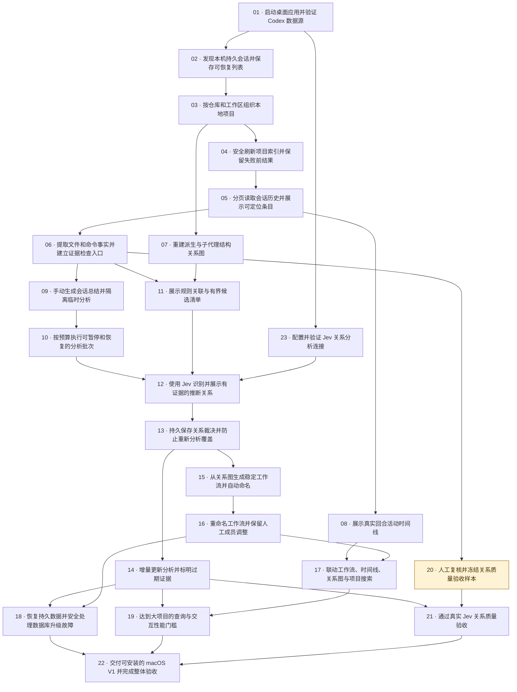

# CodexFlow V1 实施工单

完整 V1 规格及 2026-09-23 Jev 修订已同步到 GitHub。实施状态、父子关系与阻塞关系以 GitHub 为准。

父规格：[CodexFlow V1：本地项目工作过程重建完整规格](https://github.com/jinghonh/CodexFlow/issues/11)。

共 23 张工单、31 条直接阻塞关系。其中 22 张标记为 ready-for-agent，1 张人工样本复核标记为 ready-for-human。标签表示任务类型，能否开始还取决于阻塞项是否完成。

本次新增 Jev 连接配置工单，更新 12 张已有实施工单并同步父规格。Jev 负责关系及证据选择；Codex 临时会话继续负责总结和工作流命名。API Key 由用户填写并存入 macOS 钥匙串，Base URL 与模型 ID 可配置。

## 执行入口

实施入口（本次核验时无前置项）：[V1-01：启动桌面应用并验证 Codex 数据源](https://github.com/jinghonh/CodexFlow/issues/12)。

Jev 配置入口：[V1-23：配置并验证 Jev 关系分析连接](https://github.com/jinghonh/CodexFlow/issues/34)，依赖 V1-01；完成后作为 V1-12 关系分析的前置项。工单序号用于稳定引用，执行顺序以依赖为准。

每次选择前置工单已完成的开放工单，按其验收标准推进。新父规格保持开放，直到完整 V1 验收通过。

## 工单与直接依赖

1. **[V1-01：启动桌面应用并验证 Codex 数据源](https://github.com/jinghonh/CodexFlow/issues/12)**

   阻塞项：无，可立即开始。

   交付：用户启动 macOS 桌面应用，选择实际使用的 Codex 二进制，看到连接状态、版本及可用能力；连接失败时获得可操作的提示。交付一条真实贯穿 React、Tauri、核心服务与 Codex 适配器的最小路径。

   执行类型：代理实施。

2. **[V1-02：发现本机持久会话并保存可恢复列表](https://github.com/jinghonh/CodexFlow/issues/13)**

   阻塞项：[V1-01：启动桌面应用并验证 Codex 数据源](https://github.com/jinghonh/CodexFlow/issues/12)。

   交付：用户可以查看本机当前用户的全部可枚举持久会话，包括归档与子代理，并在重启或来源暂时不可用时浏览已保存的列表。

   执行类型：代理实施。

3. **[V1-03：按仓库和工作区组织本地项目](https://github.com/jinghonh/CodexFlow/issues/14)**

   阻塞项：[V1-02：发现本机持久会话并保存可恢复列表](https://github.com/jinghonh/CodexFlow/issues/13)。

   交付：用户选择本地项目后，看到属于它的会话、工作区和归属依据；同仓库 worktree 自动合并，独立克隆和嵌套仓库保持正确边界。

   执行类型：代理实施。

4. **[V1-04：安全刷新项目索引并保留失败前结果](https://github.com/jinghonh/CodexFlow/issues/15)**

   阻塞项：[V1-03：按仓库和工作区组织本地项目](https://github.com/jinghonh/CodexFlow/issues/14)。

   交付：用户打开项目时立即浏览缓存并看到一次后台刷新，能查看进度、主动刷新或取消；部分失败与进程中断不会清空历史。

   执行类型：代理实施。

5. **[V1-05：分页读取会话历史并展示可定位条目](https://github.com/jinghonh/CodexFlow/issues/16)**

   阻塞项：[V1-04：安全刷新项目索引并保留失败前结果](https://github.com/jinghonh/CodexFlow/issues/15)。

   交付：用户打开会话详情，按需查看回合和条目，并知道当前历史是否完整；不支持某种历史接口时仍能保留可读取的内容和元数据。

   执行类型：代理实施。

6. **[V1-06：提取文件和命令事实并建立证据检查入口](https://github.com/jinghonh/CodexFlow/issues/17)**

   阻塞项：[V1-05：分页读取会话历史并展示可定位条目](https://github.com/jinghonh/CodexFlow/issues/16)。

   交付：用户在会话详情看到实际文件修改、命令及可检查的来源记录，能够从事实跳到支持它的条目，为后续关系分析提供可信输入。

   执行类型：代理实施。

7. **[V1-07：重建派生与子代理结构关系图](https://github.com/jinghonh/CodexFlow/issues/18)**

   阻塞项：[V1-03：按仓库和工作区组织本地项目](https://github.com/jinghonh/CodexFlow/issues/14)。

   交付：用户进入项目关系图，直接看到来源明确记录的派生和子代理结构，并可检查每条边的依据与缺失端点。

   执行类型：代理实施。

8. **[V1-08：展示真实回合活动时间线](https://github.com/jinghonh/CodexFlow/issues/19)**

   阻塞项：[V1-05：分页读取会话历史并展示可定位条目](https://github.com/jinghonh/CodexFlow/issues/16)。

   交付：用户在项目时间线看到会话的多段真实回合活动，以及完整、部分已知或未知的时长，而不是把会话恢复间隔画成持续工作。

   执行类型：代理实施。

9. **[V1-09：手动生成会话总结并隔离临时分析](https://github.com/jinghonh/CodexFlow/issues/20)**

   阻塞项：[V1-06：提取文件和命令事实并建立证据检查入口](https://github.com/jinghonh/CodexFlow/issues/17)。

   交付：用户手动为一条会话生成可保存的目标、活动、结果、决定和问题总结，同时能够取消；分析不会污染普通历史或修改原有会话。

   执行类型：代理实施。

10. **[V1-10：按预算执行可暂停和恢复的分析批次](https://github.com/jinghonh/CodexFlow/issues/21)**

   阻塞项：[V1-09：手动生成会话总结并隔离临时分析](https://github.com/jinghonh/CodexFlow/issues/20)。

   交付：用户预览分析工作量后启动项目批次，观察进度并在预算用尽、额度错误或主动取消后继续未完成内容，无需重做已完成内容；总结/命名由 Codex 执行，关系与证据选择由 Jev 执行。

   执行类型：代理实施。

11. **[V1-11：展示规则关联与有界候选清单](https://github.com/jinghonh/CodexFlow/issues/22)**

   阻塞项：[V1-06：提取文件和命令事实并建立证据检查入口](https://github.com/jinghonh/CodexFlow/issues/17)；[V1-07：重建派生与子代理结构关系图](https://github.com/jinghonh/CodexFlow/issues/18)。

   交付：用户在项目中看到有明确事实依据的规则关联，以及将要交给模型的有限候选清单和产生原因。

   执行类型：代理实施。

12. **[V1-12：使用 Jev 识别并展示有证据的推断关系](https://github.com/jinghonh/CodexFlow/issues/23)**

   阻塞项：[V1-10：按预算执行可暂停和恢复的分析批次](https://github.com/jinghonh/CodexFlow/issues/21)；[V1-11：展示规则关联与有界候选清单](https://github.com/jinghonh/CodexFlow/issues/22)；[V1-23：配置并验证 Jev 关系分析连接](https://github.com/jinghonh/CodexFlow/issues/34)。

   交付：用户手动使用已配置的 TypeSafe Jev 分析后，在项目图中看到有证据的推断关系，点击即可检查解释和两端来源；无关系或无效证据不会产生误导性边。

   执行类型：代理实施。

13. **[V1-13：持久保存关系裁决并防止重新分析覆盖](https://github.com/jinghonh/CodexFlow/issues/24)**

   阻塞项：[V1-12：使用 Jev 识别并展示有证据的推断关系](https://github.com/jinghonh/CodexFlow/issues/23)。

   交付：用户能够确认、拒绝或恢复待裁决的推断关系；重新分析、换模型和应用重启后，这些判断仍然有效且不会改写关系来源。

   执行类型：代理实施。

14. **[V1-14：增量更新分析并标明过期证据](https://github.com/jinghonh/CodexFlow/issues/25)**

   阻塞项：[V1-13：持久保存关系裁决并防止重新分析覆盖](https://github.com/jinghonh/CodexFlow/issues/24)。

   交付：用户刷新项目并再次分析时，只处理已变化的内容；旧总结和关系会明确显示过期，迟到结果不能覆盖新版本，人工裁决持续保留。

   执行类型：代理实施。

15. **[V1-15：从关系图生成稳定工作流并自动命名](https://github.com/jinghonh/CodexFlow/issues/26)**

   阻塞项：[V1-13：持久保存关系裁决并防止重新分析覆盖](https://github.com/jinghonh/CodexFlow/issues/24)。

   交付：用户完成分析后，看到从有效关系形成的工作流及名称；未能分组的会话仍然可见，重复分析不会无故生成全新工作流身份。

   执行类型：代理实施。

16. **[V1-16：重命名工作流并保留人工成员调整](https://github.com/jinghonh/CodexFlow/issues/27)**

   阻塞项：[V1-15：从关系图生成稳定工作流并自动命名](https://github.com/jinghonh/CodexFlow/issues/26)。

   交付：用户可以给工作流改名、移动会话到已有工作流或未分组，并在重算、应用重启和并发编辑后保留自己的整理结果。

   执行类型：代理实施。

17. **[V1-17：联动工作流、时间线、关系图与项目搜索](https://github.com/jinghonh/CodexFlow/issues/28)**

   阻塞项：[V1-08：展示真实回合活动时间线](https://github.com/jinghonh/CodexFlow/issues/19)；[V1-16：重命名工作流并保留人工成员调整](https://github.com/jinghonh/CodexFlow/issues/27)。

   交付：用户从项目首页按工作流回顾历史，在时间线、关系图与会话详情之间保持选择和过滤，并能搜索相关工作。

   执行类型：代理实施。

18. **[V1-18：恢复持久数据并安全处理数据库升级故障](https://github.com/jinghonh/CodexFlow/issues/29)**

   阻塞项：[V1-14：增量更新分析并标明过期证据](https://github.com/jinghonh/CodexFlow/issues/25)；[V1-16：重命名工作流并保留人工成员调整](https://github.com/jinghonh/CodexFlow/issues/27)。

   交付：用户退出、重启或遇到存储故障后仍能保有项目缓存、分析进度、关系裁决与工作流修正；数据库升级失败不会导致数据被清空。

   执行类型：代理实施。

19. **[V1-19：达到大项目的查询与交互性能门槛](https://github.com/jinghonh/CodexFlow/issues/30)**

   阻塞项：[V1-14：增量更新分析并标明过期证据](https://github.com/jinghonh/CodexFlow/issues/25)；[V1-17：联动工作流、时间线、关系图与项目搜索](https://github.com/jinghonh/CodexFlow/issues/28)。

   交付：用户在目标规模项目中能够快速打开概览、交互关系图、搜索和检查证据，同时保持后台索引与分析可取消。

   执行类型：代理实施。

20. **[V1-20：人工复核并冻结关系质量验收样本](https://github.com/jinghonh/CodexFlow/issues/31)**

   阻塞项：[V1-06：提取文件和命令事实并建立证据检查入口](https://github.com/jinghonh/CodexFlow/issues/17)。

   交付：维护者获得一套至少 100 对会话的脱敏关系样本，能够逐对检查期望类型、方向与证据，并确认其可作为发布质量基准。

   执行类型：人工标注与复核。

21. **[V1-21：通过真实 Jev 关系质量验收](https://github.com/jinghonh/CodexFlow/issues/32)**

   阻塞项：[V1-14：增量更新分析并标明过期证据](https://github.com/jinghonh/CodexFlow/issues/25)；[V1-20：人工复核并冻结关系质量验收样本](https://github.com/jinghonh/CodexFlow/issues/31)。

   交付：维护者能够在已冻结的人工样本上使用实际 TypeSafe Jev 关系配置运行评测，并判断默认展示的关系是否达到发布质量门槛。

   执行类型：代理实施。

22. **[V1-22：交付可安装的 macOS V1 并完成整体验收](https://github.com/jinghonh/CodexFlow/issues/33)**

   阻塞项：[V1-18：恢复持久数据并安全处理数据库升级故障](https://github.com/jinghonh/CodexFlow/issues/29)；[V1-19：达到大项目的查询与交互性能门槛](https://github.com/jinghonh/CodexFlow/issues/30)；[V1-21：通过真实 Jev 关系质量验收](https://github.com/jinghonh/CodexFlow/issues/32)。

   交付：用户可以安装并运行完整 macOS V1，从项目发现一路完成事实检查、手动分析、证据裁决、工作流整理和历史回顾，并有可重复的整体验收记录。

   执行类型：代理实施。

23. **[V1-23：配置并验证 Jev 关系分析连接](https://github.com/jinghonh/CodexFlow/issues/34)**

   阻塞项：[V1-01：启动桌面应用并验证 Codex 数据源](https://github.com/jinghonh/CodexFlow/issues/12)。

   交付：用户在桌面应用中填写 Jev 的 API Key、Base URL 与模型 ID，保存后可以分别验证连接和固定合成推理；重新打开应用仍能使用配置，也可以替换或删除密钥。

   执行类型：代理实施。

## 依赖图

箭头从前置工单指向依赖它的工单。

## 规格覆盖

| 工单 | 用户故事 | 核心验收场景 |
| --- | --- | --- |
| [01](https://github.com/jinghonh/CodexFlow/issues/12) | 31、32 | 协议与架构基线 |
| [02](https://github.com/jinghonh/CodexFlow/issues/13) | 3、4、6、7、8、40 | 1、2 |
| [03](https://github.com/jinghonh/CodexFlow/issues/14) | 1、2、36 | 10 |
| [04](https://github.com/jinghonh/CodexFlow/issues/15) | 6、7、8、13、31 | 2、8、15 |
| [05](https://github.com/jinghonh/CodexFlow/issues/16) | 9、20、41 | 2、8 |
| [06](https://github.com/jinghonh/CodexFlow/issues/17) | 9、19、20 | 5 |
| [07](https://github.com/jinghonh/CodexFlow/issues/18) | 5、27 | 1、17 |
| [08](https://github.com/jinghonh/CodexFlow/issues/19) | 10、11、12、27、41 | 3、4 |
| [09](https://github.com/jinghonh/CodexFlow/issues/20) | 14、16、30 | 8、9、14 |
| [10](https://github.com/jinghonh/CodexFlow/issues/21) | 15、29、37、38、39、40、44 | 8、13、14、15、22 |
| [11](https://github.com/jinghonh/CodexFlow/issues/22) | 17、19、37 | 17 |
| [12](https://github.com/jinghonh/CodexFlow/issues/23) | 18、19、20、21、24、42、44 | 5、7、8、17、21、22 |
| [13](https://github.com/jinghonh/CodexFlow/issues/24) | 22、23、24 | 6、15 |
| [14](https://github.com/jinghonh/CodexFlow/issues/25) | 8、19、23、24、29、43 | 5、6、8、15、22 |
| [15](https://github.com/jinghonh/CodexFlow/issues/26) | 25、26 | 11 |
| [16](https://github.com/jinghonh/CodexFlow/issues/27) | 33、34、35、40 | 11、12、15 |
| [17](https://github.com/jinghonh/CodexFlow/issues/28) | 13、27、28 | 11、18 |
| [18](https://github.com/jinghonh/CodexFlow/issues/29) | 7、31、40、43 | 15、16、20 |
| [19](https://github.com/jinghonh/CodexFlow/issues/30) | 8、15、27、28 | 18 |
| [20](https://github.com/jinghonh/CodexFlow/issues/31) | 18、19、20 | 5、7 |
| [21](https://github.com/jinghonh/CodexFlow/issues/32) | 18、19、20、21 | 5、7、9、21、22 |
| [22](https://github.com/jinghonh/CodexFlow/issues/33) | 1、5、10、16、19、25、26、27、31、40、42、43、44 | 1、2、3、4、5、6、7、8、9、10、11、12、13、14、15、16、17、18、19、20、21、22 |
| [23](https://github.com/jinghonh/CodexFlow/issues/34) | 42、43、44 | 19、20 |

- 44 条用户故事与 22 个核心验收场景全部覆盖。
- 依赖图无环，且无重复的间接依赖。
- 本次发布后，全部票据正文、状态、标签、原生父议题与原生阻塞关系已回读核验。
- 人工复核负责冻结质量样本；真实 Jev 质量验收依赖该样本，自动测试采用固定结果。

## 旧事项

[旧规格《实现 Codex Conversation Graph & Timeline MVP》](https://github.com/jinghonh/CodexFlow/issues/1)及其九张工单已被新规格与工单替代。
旧事项已注明替代关系，以“不再计划”原因关闭并移除 ready-for-agent；原正文保留。关闭不表示旧事项已实现。
